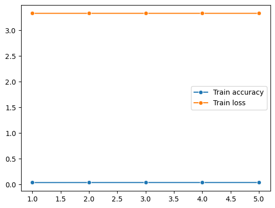
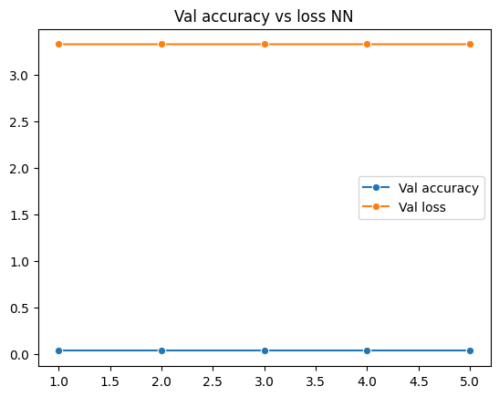
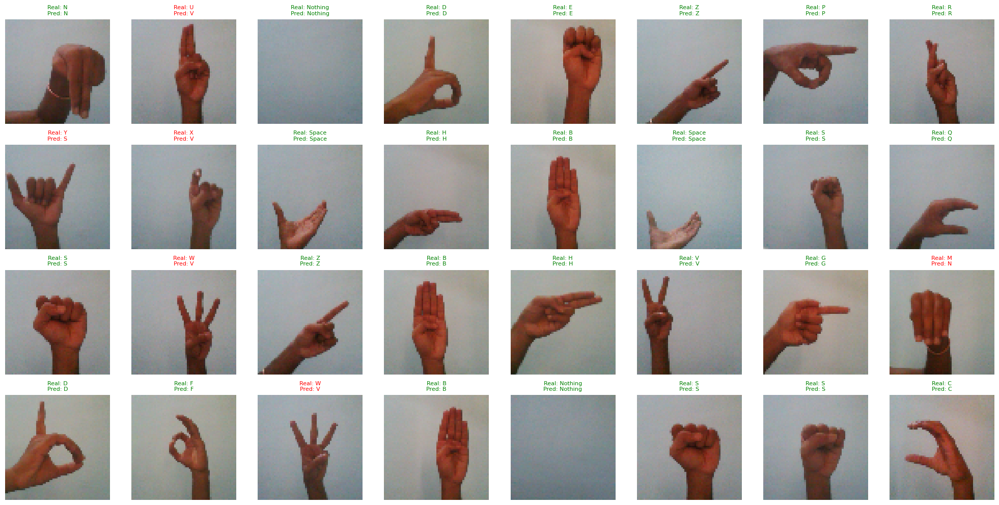
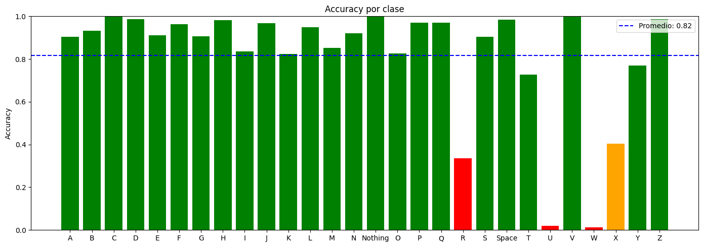
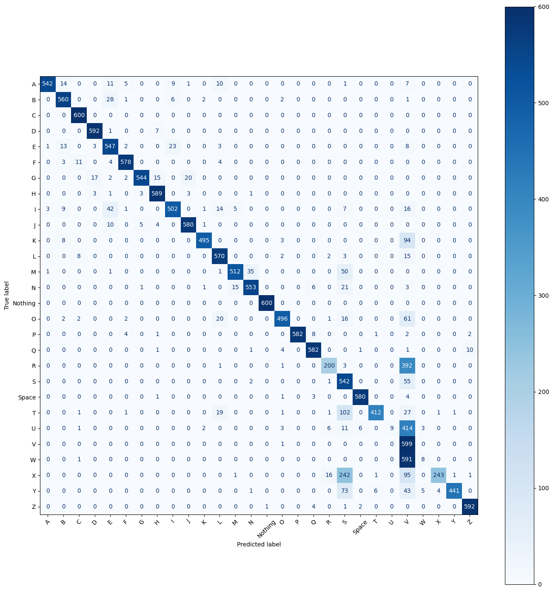

# AI ASL Identifier
### Paulina Almada Martínez - A01710029
Este repositorio contiene todo el código necesario para la generación de un modelo de inteligencia artificial que clasifica imágenes de símbolos de ASL (American Sign Language) para identificar qué letra representan.

## ¿Cómo preparamos los datos?
### Obtención de datos
Para este proyecto, utilizamos el dataset [American Sign Language](https://www.kaggle.com/datasets/kapillondhe/american-sign-language/data?select=ASL_Dataset) de Kapil Londhe, consultado en Kaggle. Se utilizó la librería KaggleHub para cargar las imágenes del dataset al notebook en Google Colab.

Este dataset incluye **165,782 fotografías RBG** (a color) de todas las símbolos del alfabeto del lenguaje de señas americano. Viene pre-dividido en conjuntos de test y train con **28 categorías** en cada subconjunto de datos. En train, tenemos fotografías etiquetadas para cada signo con la misma mano y el mismo fondo pero variaciones en la posición de la mano y la cercanía de la mano a la cámara.

  
   
  <i>Fig 1. Ejemplos de imágenes de train para la letra A.</i>

La cantidad de imágenes por letra varía, con un mínimo de 4,542 fotos y un máximo de 5,996 fotos. Por eso, podemos concluir que el dataset viene **balanceado**, ya que pocas categorías tienen diferencias mínimas en su cantidad de imágenes comparadas con las otras.

Es importante mencionar que en la carpeta test tenemos fotografías con la misma mano y fondo que train, pero todos los símbolos solamente tienen **4 fotos**, que representa menos del 1% del conjunto de imágenes para cada símbolo. Además, todas las fotos de test para cada letra tienen la misma cercanía a la cámara y son esencialmente iguales. Esto es a diferencia de las imágenes de train, que tienen variedad en sus posiciones y distancia a la cámara.

  
   
  <i>Fig 2. Las cuatro imágenes de test para la letra A.</i>

### Split de datos
Considerando la disparidad en cantidad y variaciones en los conjuntos pre-establecidos de test y train, definimos realizar nuestro propio split aleatorio entre train y test para el propósito de este proyecto, principalmente para mejorar la cantidad y calidad de nuestras imágenes de test. Además, agregamos una división para tener datos de validación.

Para realizar esto, primero debemos cargar las imágenes a nuestro proyecto. Estas van a venir en su división original, por lo que procedemos a crear una nueva carpeta (*asl_mixed*) donde mezclamos las imágenes de test y train en una sola sub-carpeta por categoría. A base de esta carpeta mezclada, realizamos nuestro split con la librería de sklearn. Ya que estamos trabajando con carpetas, vamos a realizar este split a través de pasar las imágenes a tres nuevas carpetas (test, train y val) dentro de una nueva carpeta padre (*asl_split*). Realizamos una división **80% - 10% - 10%** por la gran cantidad de imágenes con las que contamos. Esto resulta en **132K imágenes de train** (~4.7K por categoría) y **16.5K imágenes para test y val** respectivamente (~589 por categoría).

Este proceso solamente tiene que realizarse una primera y única vez al montar el proyecto, ya que al final del split se guarda la carpeta dividida a Google Drive como **un archivo zip** que se puede cargar directamente a la sesión en futuras iteraciones.

### Preprocesado de datos
Ya que las imágenes, como discutimos anteriormente, tienen iluminación y fondo parejos y están a color, no tenemos que realizar pasos extra de preprocesado para emparejar las imágenes. Por eso, nuestro único paso de preprocesado es un rescalamiento de los pixeles a rangos de 0-1 (dividiendo por 255) y una reducción del tamaño de las imágenes a 64 x 64. Ambos cambios ayudan a mejorar el rendimiento del modelo y permiten que sea más fácil para el modelo trabajar con las imágenes.

## ¿Qué modelos entrenamos?
### 1) Modelo DNN
Como un primer acercamiento a nuestro clasificador de ASL, montamos una red nueronal densa (DNN). Este modelo es un clásico para los problemas de clasificación, ya que pueden detectar y aprender relaciones complejas y no lineales entre sets de datos.

#### Arquitectura
Por convención, configuramos una primera capa de 128 neurones con una función de activación ReLU (una función de activación estándar) y una segunda capa de clasificación con una función de activación softmax (típica para problemas de clasificación multiclase). Ya que tenemos 28 categorías, montamos 28 neuronas de clasificación en esta última capa. Además, este modelo utiliza el optimizador Adam (igualmente estándar) y la métrica de cross-entropy loss para ajustar su aprendizaje.

#### Resultados
Los resultados de este primer modelo son bastante malos. A lo largo de 5 epochs, solamente se logra un **accuracy de ~3%** tanto para los valores de train y de validación. Aunque existen varias métricas de evluación, nos enfocamos en el accuracy porque esta es la más comúnmente utilizada en investigaciones de modelos de deep learning para clasificación de símbolos ASL[^1][^2][^3][^4][^5].

Este accuracy tan bajo en train y val de cajón nos indica que el modelo presenta **underfitting**. Pero analizando a mayor detalle las líneas de tendencia del accuracy y loss en el entramiento de este modelo, que notamos **presentan casi ningún cambio**, podemos identificar la razón detrás de este underfitting: el modelo simplemente no está aprendiendo los datos.

  
  
   
  <i>Fig 3. Gráficas de accuracy / loss para train (izquierda) y val (derecha) del modelo DNN.</i>

Un rendimiento así de bajo con un modelo así de simple nos indica que el problema principal es que la arquitectura es demasiado simple para el problema que queremos resolver. Por eso, para nuestra siguiente iteración definimos utilizar una arquitectura más robusta, esperando que esto mejore nuestro accuracy.

### 2) Modelo CNN
Revisando la literatura existente sobre modelos desarrollados para la clasificación ASL, notamos que una gran cantidad están basadas en las redes neuronales convolutivas (CNN)[^1][^2][^4][^5]. Esto no es sorprendente, ya que las CNNs son justamente de las arquitecturas más comunes para la clasificación de imágenes, ya que están diseñadas para manejar datos estructurados que se procesan en capas. En la literatura, es común que distintos enfoques realicen modificaciones a un CNN base (resultando en modelos conocidos como Custom Convolutional Neuronal Networks o CCNNs), como agregar capas convolucionales o de pooling[^1][^5] y utilizar una estructura siamesa para calcular similitud entre embeddings de cada símbolo[^4], pero quise empezar con un baseline comparativo del efecto que tiene agregar una capa convolutiva comparado con mi modelo DNN antes de empezar a realizar refinamientos. Esto, para primero tener un modelo fiable sobre el que se pueda diagnosticar problemas específicos con el dataset en vez de que simplemente sobrepasa las capacidades del modelo. Por eso, esta siguiente iteración utiliza un CNN "vainilla" con una configuración estándar.

#### Arquitectura
Para crear este CNN inicial, agregamos una capa convolutiva de 10 filtros (estándar y simple) a nuestro modelo DNN. También aumentamos al doble las neuronas de nuestra primera capa densa (subiendo a 256 en vez de 128) por convención. El resto de la configuración es igual a la del modelo anterior. Esto, para comprobar nuestra teoría que el problema más importante de nuestro primer modelo es que la arquitectura era demasiado simple.

#### Resultados generales
Evaluando los resultados de este modelo, confirmamos que efectivamente montar un modelo adecuadamente complejo para el problema tiene una mejora significativa en el rendimiento. A lo largo de los mismos 5 epochs que el modelo anterior, se logra llegar hasta un **accuracy de ~87% en train** y un **accuracy de ~82% en val**. También se reduce consistentemente el loss a lo largo de los epochs, demostrando que el modelo está aprendiendo y es capaz de ajustarse a los datos, aunque es notable que para val, subió en el último epoch, indicando un posible problema con el ajuste de los datos cuando el modelo interactúa con datos con los que no entrenó.

  
  
   
  <i>Fig 4. Gráficas de accuracy / loss para train (izquierda) y val (derecha) del modelo CNN.</i>

Es importante resaltar que, aunque los valores en general mejoraron bastante, los valores de accuracy de train y val no son tan cercanos y el accuracy de train es mejor (0.8728 vs 0.8256 respectivamente). Esto es una señal que seguimos teniendo un **underfitting** en el modelo, aunque es mucho menor que antes.

Ya que nuestros resultados ya son fiables (>70% accuracy), procedemos con nuestra primera evaluación del modelo con los datos de test. Con este set de datos, el modelo logra un **accuracy de ~82%**. Es interesante notar que este valor es muy parecido al accuracy de val (0.8233 de test vs 0.8256 de val), lo cual nos indica que val está sirviendo como una primera prueba realista del rendimiento del modelo.

  
   
  <i>Fig 4. Gráficas de accuracy / loss para train (izquierda) y val (derecha) del modelo CNN.</i>

#### Resultados por categoría
Aunque el modelo tiene un buen rendimiento, para identificar áreas de mejora y refinamiento para la siguiente iteración revisamos más a detalle cómo se comporta con cada categoría. Esto nos permitirá identificar en qué se está equivocando el modelo y, por ende, qué estrategias utilizar.

Analizando el valor de accuracy por cada categoría, notamos cuatro símbolos con valores alarmantes: **R, U, W** y **X**. Los símbolos **T** y **Y** también se encuentran por debajo del promedio, así que igual requieren más atención. Ya que el dataset está balanceado, esto nos indica que nuestro modelo no aprendió estos símbolos por algo en nuestra configuración del modelo.

  
   
  <i>Fig 6. Accuracy por categoría del CNN (test).</i>

Para entender mejor cuáles son los problemas específicos de estos símbolos, revisamos el precisión, recall y F1 de cada categoría. Aunque la literatura solamente considera el accuracy como métrica de evaluación, estas métricas nos dan más información sobre cómo el modelo está generando predicciones para cada categoría.

Con estos valores podemos identificar que las categorías con bajos accuracies que identificamos también tienen F1 scores bajos (de hasta 0.04). Notablemente, también identificamos que dos categorías con muy altos accuracy (**S** y **V**) no están teniendo un comportamiento óptimo tampoco.

Revisando a mayor detalle, encontramos que:

* **R** tiene una precisión de 0.88 y un recall de 0.34. El modelo no está encontrando R lo suficiente, pero generalmente es capaz de reconocerlo cuando lo encuentra.
* **S** tiene una precisión de 0.51 y un recall de 0.9. El modelo está prediciendo S de más.
* **U** tiene una precisión de 1 y un recall de 0.02. El modelo casi nunca encuentra la letra U, pero nunca asigna esa predicción a una letra que no corresponde. Es notable que U es la letra menor representada en el dataset.
* **V** tiene una precisión de 0.25 y un recall de 1. Todas las instancias de V se están encontrando, pero también varios símbolos que no son V se están prediciendo como si fueran V.
* **W** tiene una precisión de 0.5 y un recall de 0.01. Este símbolo es el que más le está costando al modelo, ya que casi nunca lo encuentra y utiliza este símbolo como predicción errónea en otras letras.
* **X** tiene una precisión de 0.98 y un recall de 0.41. El modelo le está costando encontrar el símbolo, pero rara vez lo predice incorrectamente.
* **Y** tiene una precisión de 1 y un recall de 0.77. El modelo siempre predice este símbolo correctamente, pero no siempre lo encuentra.

Para comprender cómo se están asignando predicciones erróneas en los casos de bajo recall, agregamos una Confusion Matrix como otra métrica[^3]. Esta matriz nos permite visualizar, para cada categoría, cómo se distribuyen las predicciones comparadas con las otras categorías, que es justamente lo que queremos saber.

  
  <i>Fig 7. Confusion Matrix del CNN.</i>

Con esta matriz, identificamos los siguientes patrones importantes:
* **R** se confunde principalmente por **V**.
* **T** se confunde principalmente por **S**.
* **U** se confunde principalmente por **V**.
* **W** se confunde principalmente por **V**.
* **X** se confunde principalmente por **S** y **V**. Se confunde más por S.
* **Y** se confunde principalmente por **S** y **V**. Se confunde más por S.

En otras palabras, el modelo parece no haber aprendido correctamente principalmente las categorías **S** y **V**, ya que son las dos categorías que más predice cuando no identifica un símbolo.

Para nuestra siguiente iteración, vamos a ajustar los hiper parámetros de nuestro CNN para reducir el **underfitting** que seguimos teniendo, enfocados principalmente en el conjunto de símbolos que identificamos le está costando más al modelo.

## Correcciones
* Se agregó la documentación del preprocesado de datos al README.
* Se agregó la funcionalidad de guardar los datos preprocesados en un archivo zip para cargar de Google Drive en futuras iteraciones.

[^1]: P. Moon, G. Yenurkar, V. O. Nyangaresi, A. Raut, N. Dapkekar, J. Rathod, and P. Dabare, "An improved custom convolutional neural network based hand sign recognition using machine learning algorithm," *Engineering Reports*, vol. 6 no. 10, Feb. 2024. doi: 10.1002/eng2.12878. [Online]. Available: https://onlinelibrary.wiley.com/doi/epdf/10.1002/eng2.12878?getft_integrator=scopus&src=getftr.
‌
[^2]: S. B. S. Mugdha, H. Das, M. Uddin, M. E. Arafat, and M. M. Islam, "DeafTech Vision: A Visual Computer's Approach to Accessible Communication through Deep Learning-Driven ASL Analysis," *Stat., Optim. Inf. Comput.*, vol. 12, no. 6, pp. 1795–1811, Jun. 2024. doi: 10.19139/soic-2310-5070-2020. [Online]. Available: https://iapress.org/index.php/soic/article/view/2020/1120.

[^3]: B. Alsharif, E. Alalwany, A. Ibrahim, I. Mahgoub, and M. Ilyas, "Real-Time American Sign Language Interpretation Using Deep Learning and Keypoint Tracking," *Sensors*, vol. 25, Mar 2025. doi: 10.3390/s25072138. [Online]. Available: https://www.mdpi.com/1424-8220/25/7/2138.

[^4]: A. N. Fierro Radilla, K. R. Perez Daniel, G. Benitez Garcia, P. Najera Garcia, and R. Fuentes Valdez, "Similarity Learning for CNN-Based ASL Alphabet Recognition," *Frontiers in Artificial Intelligence and Applications*, vol. 337, pp. 633-645, 2021. doi: 10.3233/faia210060.

[^5]: P. Das, T. Ahmed, and M. F. Ali, "Static Hand Gesture Recognition for American Sign Language Using Deep Convolutional Neural Network," *2020 IEEE Region 10 Symposium (TENSYMP)*, pp. 1795–1811, June 2020. doi: 10.1109/TENSYMP50017.2020.9230772. [Online]. Available: https://ieeexplore.ieee.org/document/9230772.