# AI ASL Identifier

## Paulina Almada Martínez - A01710029

Este repositorio contiene todo el código necesario para la generación de un modelo de inteligencia artificial que clasifica imágenes de símbolos de ASL (American Sign Language) para identificar qué letra representan.

## ¿Cómo preparamos los datos?

### Obtención de datos

Para este proyecto, utilizamos el dataset [American Sign Language](https://www.kaggle.com/datasets/kapillondhe/american-sign-language/data?select=ASL_Dataset) de Kapil Londhe, consultado en Kaggle. Se utilizó la librería KaggleHub para cargar las imágenes del dataset al notebook en Google Colab.

Este dataset incluye **165,782 fotografías RBG** (a color) de todas las símbolos del alfabeto del lenguaje de señas americano. Viene pre-dividido en conjuntos de test y train con **28 categorías** en cada subconjunto de datos. En train, tenemos fotografías etiquetadas para cada símbolo con la misma mano y el mismo fondo pero variaciones en la posición de la mano y la cercanía de la mano a la cámara.

  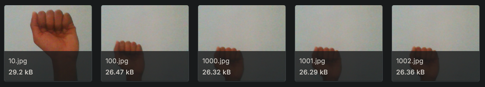
   
  <i>Fig 1. Ejemplos de imágenes de train para la letra A.</i>

La cantidad de imágenes por letra varía, con un mínimo de 4,542 fotos y un máximo de 5,996 fotos. Por eso, podemos concluir que el dataset viene **balanceado**, ya que pocas categorías tienen diferencias mínimas en su cantidad de imágenes comparadas con las otras.

Es importante mencionar que en la carpeta test tenemos fotografías con la misma mano y fondo que train, pero todos los símbolos solamente tienen **4 fotos**, que representa menos del 1% del conjunto de imágenes para cada símbolo. Además, todas las fotos de test para cada letra tienen la misma cercanía a la cámara y son esencialmente iguales. Esto es a diferencia de las imágenes de train, que tienen variedad en sus posiciones y distancia a la cámara.

  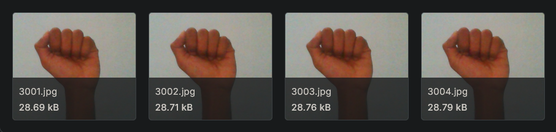
   
  <i>Fig 2. Las cuatro imágenes de test para la letra A.</i>

### Split de datos

Considerando la disparidad en cantidad y variaciones en los conjuntos pre-establecidos de test y train, definimos realizar nuestro propio split aleatorio entre train y test para el propósito de este proyecto, principalmente para mejorar la cantidad y calidad de nuestras imágenes de test. Además, agregamos una división para tener datos de validación.

Para realizar esto, primero debemos cargar las imágenes a nuestro proyecto. Estas van a venir en su división original, por lo que procedemos a crear una nueva carpeta (*asl_mixed*) donde mezclamos las imágenes de test y train en una sola sub-carpeta por categoría. A base de esta carpeta mezclada, realizamos nuestro split con la librería de sklearn. Ya que estamos trabajando con carpetas, vamos a realizar este split a través de pasar las imágenes a tres nuevas carpetas (test, train y val) dentro de una nueva carpeta padre (*asl_split*). Realizamos una división **80% - 10% - 10%** por la gran cantidad de imágenes con las que contamos. Esto resulta en **132K imágenes de train** (~4.7K por categoría) y **16.5K imágenes para test y val** respectivamente (~589 por categoría).

Este proceso solamente tiene que realizarse una primera y única vez al montar el proyecto, ya que al final del split se guarda la carpeta dividida a Google Drive como **un archivo zip** que se puede cargar directamente a la sesión en futuras iteraciones.

### Preprocesado de datos

Ya que las imágenes, como discutimos anteriormente, tienen iluminación y fondo parejos y están a color, no tenemos que realizar pasos extra de preprocesado para emparejar las imágenes. Por eso, nuestro único paso de preprocesado es un rescalamiento de los pixeles a rangos de 0-1 (dividiendo por 255) y una reducción del tamaño de las imágenes a 64 x 64. Ambos cambios ayudan a mejorar el rendimiento del modelo y permiten que sea más fácil para el modelo trabajar con las imágenes.

## ¿Qué modelos entrenamos?

### 1) Modelo DNN

Como un primer acercamiento a nuestro clasificador de ASL, montamos una red nueronal densa (DNN). Este modelo es un clásico para los problemas de clasificación, ya que pueden detectar y aprender relaciones complejas y no lineales entre sets de datos.

### Arquitectura

Por convención, configuramos una primera capa de 128 neurones con una función de activación ReLU (una función de activación estándar) y una segunda capa de clasificación con una función de activación softmax (típica para problemas de clasificación multiclase). Ya que tenemos 28 categorías, montamos 28 neuronas de clasificación en esta última capa. Además, este modelo utiliza el optimizador Adam (igualmente estándar) y la métrica de cross-entropy loss para ajustar su aprendizaje.

### Resultados

Los resultados de este primer modelo son bastante malos. A lo largo de 5 epochs, solamente se logra un **accuracy de ~3%** tanto para los valores de train y de validación. Aunque existen varias métricas de evluación, nos enfocamos en el accuracy porque esta es la más comúnmente utilizada en investigaciones de modelos de deep learning para clasificación de símbolos ASL[^1][^2][^3][^4][^5].

Este accuracy tan bajo en train y val de cajón nos indica que el modelo presenta **underfitting**. Pero analizando a mayor detalle las líneas de tendencia del accuracy y loss en el entramiento de este modelo, que notamos **presentan casi ningún cambio**, podemos identificar la razón detrás de este underfitting: el modelo simplemente no está aprendiendo los datos.

  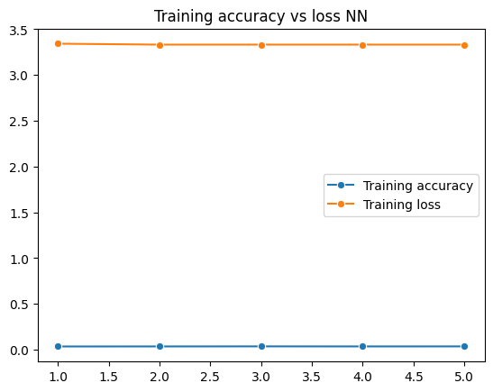
  
   
  <i>Fig 3. Gráficas de accuracy / loss para train (izquierda) y val (derecha) del modelo DNN.</i>

Un rendimiento así de bajo con un modelo así de simple nos indica que el problema principal es que la arquitectura es demasiado simple para el problema que queremos resolver. Por eso, para nuestra siguiente iteración definimos utilizar una arquitectura más robusta, esperando que esto mejore nuestro accuracy.

### 2) Modelo CNN

Revisando la literatura existente sobre modelos desarrollados para la clasificación ASL, notamos que una gran cantidad están basadas en las redes neuronales convolutivas (CNN)[^1][^2][^4][^5]. Esto no es sorprendente, ya que las CNNs son justamente de las arquitecturas más comunes para la clasificación de imágenes, ya que están diseñadas para manejar datos estructurados que se procesan en capas. En la literatura, es común que distintos enfoques realicen modificaciones a un CNN base (resultando en modelos conocidos como Custom Convolutional Neuronal Networks o CCNNs), como agregar capas convolucionales o de pooling[^1][^5] y utilizar una estructura siamesa para calcular similitud entre embeddings de cada símbolo[^4], pero quise empezar con un baseline comparativo del efecto que tiene agregar una capa convolutiva comparado con mi modelo DNN antes de empezar a realizar refinamientos. Esto, para primero tener un modelo fiable sobre el que se pueda diagnosticar problemas específicos con el dataset en vez de que simplemente sobrepasa las capacidades del modelo. Por eso, esta siguiente iteración utiliza un CNN "vainilla" con una configuración estándar.

### Arquitectura

Para crear este CNN inicial, agregamos una capa convolutiva de 10 filtros (estándar y simple) a nuestro modelo DNN. También aumentamos al doble las neuronas de nuestra primera capa densa (subiendo a 256 en vez de 128) por convención. El resto de la configuración es igual a la del modelo anterior. Esto, para comprobar nuestra teoría que el problema más importante de nuestro primer modelo es que la arquitectura era demasiado simple.

### Resultados generales

Evaluando los resultados de este modelo, confirmamos que efectivamente montar un modelo adecuadamente complejo para el problema tiene una mejora significativa en el rendimiento. A lo largo de los mismos 5 epochs que el modelo anterior, se logra llegar hasta un **accuracy de ~87% en train** y un **accuracy de ~82% en val**. También se reduce consistentemente el loss a lo largo de los epochs, demostrando que el modelo está aprendiendo y es capaz de ajustarse a los datos, aunque es notable que para val, subió en el último epoch, indicando un posible problema con el ajuste de los datos cuando el modelo interactúa con datos con los que no entrenó.

  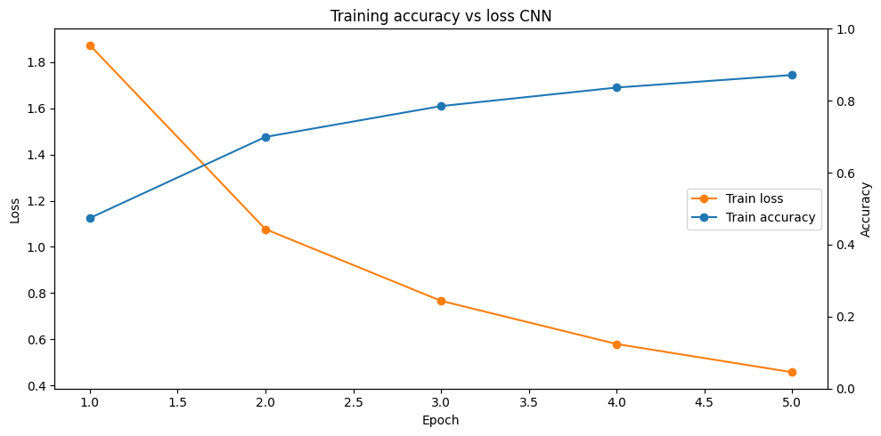
  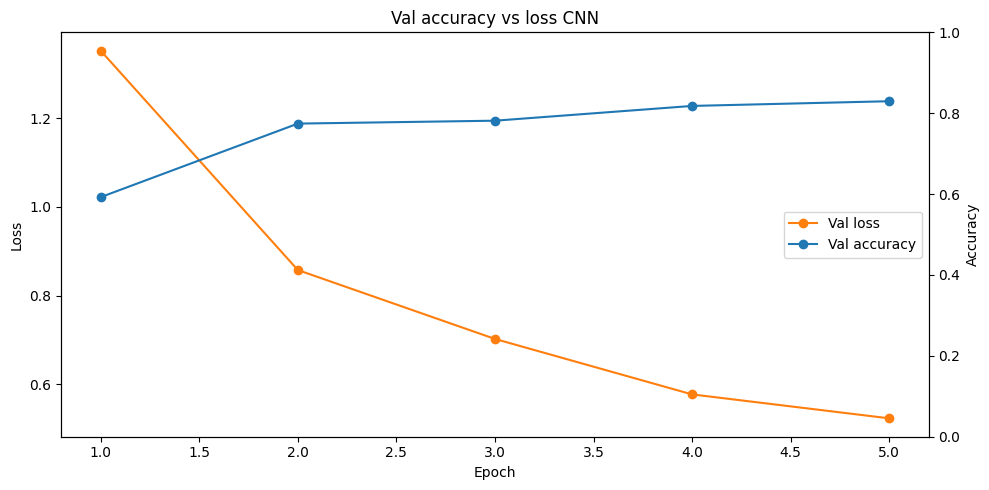
   
  <i>Fig 4. Gráficas de accuracy / loss para train (izquierda) y val (derecha) del modelo CNN.</i>

Es importante resaltar que, aunque los valores en general mejoraron bastante, los valores de accuracy de train y val no son tan cercanos y el accuracy de train es mejor (0.8728 vs 0.8256 respectivamente). Esto es una señal que seguimos teniendo un **underfitting** en el modelo, aunque es mucho menor que antes.

Ya que nuestros resultados ya son fiables (>70% accuracy), procedemos con nuestra primera evaluación del modelo con los datos de test. Con este set de datos, el modelo logra un **accuracy de ~82%**. Es interesante notar que este valor es muy parecido al accuracy de val (0.8233 de test vs 0.8256 de val), lo cual nos indica que val está sirviendo como una primera prueba realista del rendimiento del modelo.

  
   
  <i>Fig 5. Resultados del primer batch de test del CNN.</i>

### Resultados por categoría

Aunque el modelo tiene un buen rendimiento, para identificar áreas de mejora y refinamiento para la siguiente iteración revisamos más a detalle cómo se comporta con cada categoría. Esto nos permitirá identificar en qué se está equivocando el modelo y, por ende, qué estrategias utilizar.

Analizando el valor de accuracy por cada categoría, notamos cuatro símbolos con valores alarmantes: **R, U, W** y **X**. Los símbolos **T** y **Y** también se encuentran por debajo del promedio, así que igual requieren más atención. Ya que el dataset está balanceado, esto nos indica que nuestro modelo no aprendió estos símbolos por algo en nuestra configuración del modelo.

  
   
  <i>Fig 6. Accuracy por categoría del CNN (test).</i>

Para entender mejor cuáles son los problemas específicos de estos símbolos, revisamos el precisión, recall y F1 de cada categoría. Aunque la literatura solamente considera el accuracy como métrica de evaluación, estas métricas nos dan más información sobre cómo el modelo está generando predicciones para cada categoría.

Con estos valores podemos identificar que las categorías con bajos accuracies que identificamos también tienen F1 scores bajos (de hasta 0.04). Notablemente, también identificamos que dos categorías con muy altos accuracy (**S** y **V**) no están teniendo un comportamiento óptimo tampoco.

Revisando a mayor detalle, encontramos que:

* **R** tiene una precisión de 0.88 y un recall de 0.34. El modelo no está encontrando R lo suficiente, pero generalmente es capaz de reconocerlo cuando lo encuentra.
* **S** tiene una precisión de 0.51 y un recall de 0.9. El modelo está prediciendo S de más.
* **U** tiene una precisión de 1 y un recall de 0.02. El modelo casi nunca encuentra la letra U, pero nunca asigna esa predicción a una letra que no corresponde. Es notable que U es la letra menor representada en el dataset.
* **V** tiene una precisión de 0.25 y un recall de 1. Todas las instancias de V se están encontrando, pero también varios símbolos que no son V se están prediciendo como si fueran V.
* **W** tiene una precisión de 0.5 y un recall de 0.01. Este símbolo es el que más le está costando al modelo, ya que casi nunca lo encuentra y utiliza este símbolo como predicción errónea en otras letras.
* **X** tiene una precisión de 0.98 y un recall de 0.41. El modelo le está costando encontrar el símbolo, pero rara vez lo predice incorrectamente.
* **Y** tiene una precisión de 1 y un recall de 0.77. El modelo siempre predice este símbolo correctamente, pero no siempre lo encuentra.

Para comprender cómo se están asignando predicciones erróneas en los casos de bajo recall, agregamos una Confusion Matrix como otra métrica[^3]. Esta matriz nos permite visualizar, para cada categoría, cómo se distribuyen las predicciones comparadas con las otras categorías, que es justamente lo que queremos saber.

  
  <i>Fig 7. Confusion Matrix del CNN.</i>

Con esta matriz, identificamos los siguientes patrones importantes:

* **R** se confunde principalmente por **V**.
* **T** se confunde principalmente por **S**.
* **U** se confunde principalmente por **V**.
* **W** se confunde principalmente por **V**.
* **X** se confunde principalmente por **S** y **V**. Se confunde más por S.
* **Y** se confunde principalmente por **S** y **V**. Se confunde más por S.

En otras palabras, el modelo parece no haber aprendido correctamente principalmente las categorías **S** y **V**, ya que son las dos categorías que más predice cuando no identifica un símbolo.

Para nuestra siguiente iteración, vamos a ajustar los hiper parámetros de nuestro CNN para reducir el **underfitting** que seguimos teniendo, enfocados principalmente en el conjunto de símbolos que identificamos le está costando más al modelo.

### 3) Custom CNN

Considerando que el modelo CNN principalmente se ve afectado porque tiene ciertos símbolos que presentan una confusión constante, el cambio que tendrá un mayor impacto es agregar una segunda capa convolutiva que distingue específicamente estas categorías[^1]. Además, agregamos capas de MaxPooling 2D que reducen el tamaño del embedding, extrayendo el promedio de los features representativos[^2]. Finalmente, aplicamos el doble de epochs para darle al modelo una mayor cantidad de oportunidades de corregirse durante su aprendizaje. Aunque la literatura por lo general entrena con 30 o más epochs[^1][^4], por limitaciones de hardware y porque 5 epochs al momento han dado buenos resultados, nos quedamos con **10 epochs** para este modelo.

### Arquitectura

Para crear este CNN más poderoso, aumentamos el número de capas de las capas convolutivas de 10 filtros a 32 filtros[^1][^2]. Después, agregamos nuestra primera capa de MaxPooling 2x2. Repetimos estas combinación de capa convolutiva y capa de poolings. El resultado, que ha reducido la imagen a 14x14, se vectoriza para pasar por dos capas densas. La primera tiene 128 neuronas, la segunda 96. Reducimos el número de neuronas de ambas capas porque, para este punto, hemos estado comprimiendo el embedding, por lo que ya no se requiere tanto poder de procesamiento en estas últimas etapas. Finalmente, se clasifica con las 28 neuronas para las 28 categorías.

### Resultados generales

Evaluando los resultados de este modelo, confirmamos que los cambios que realizamos de nuevo tuvieron una mejora en el rendimiento. A lo largo de 10 epochs, se logra llegar hasta un **accuracy de ~96% en train** y un **accuracy de ~97% en val**. También se reduce consistentemente el loss a lo largo de los epochs con un solo incremento durante el penúltimo epoch. Este es menor al que se presentó en el modelo anterior.

  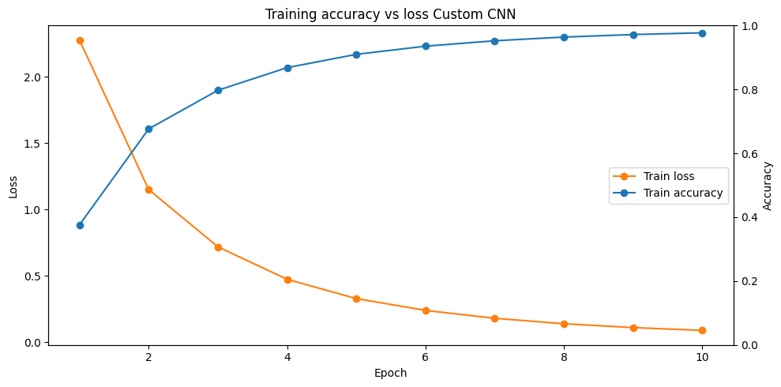
  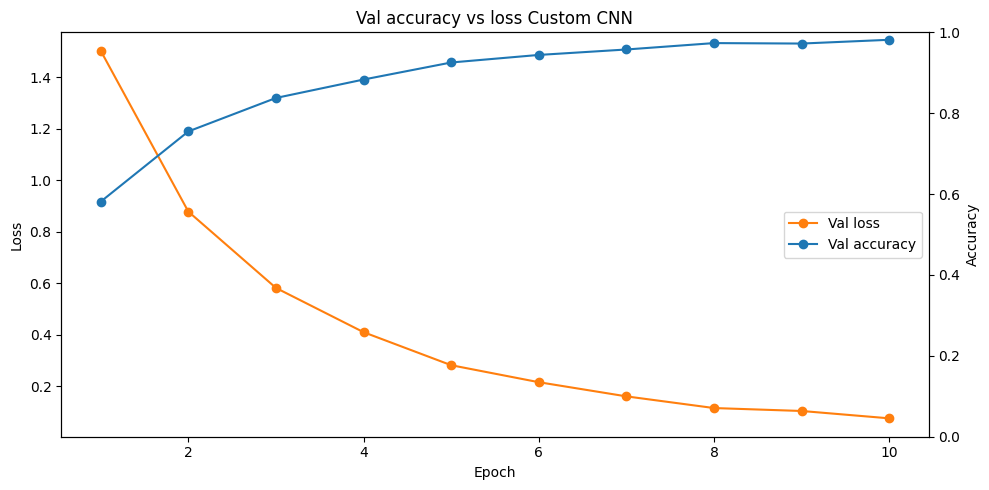
   
  <i>Fig 8. Gráficas de accuracy / loss para train (izquierda) y val (derecha) del modelo Custom CNN.</i>

Es importante resaltar que los valores de accuracy de train y val son muy parecidos y el accuracy de val es ligeramente mejor (0.9650 vs 0.9733 respectivamente). Esto es una buena señal que tenemos un **fitting** adecuado de los datos, pero no se puede confirmar hasta ver los resultados de test.

Por eso, procedemos con la evaluación del modelo con los datos de test. Con este set de datos, el modelo logra un **accuracy de ~97%**. Es interesante notar que este valor es muy parecido al accuracy de val (0.9715 de test vs 0.9733 de val). Con esto, podemos confirmar que este modelo tiene un **fitting** de los datos.

  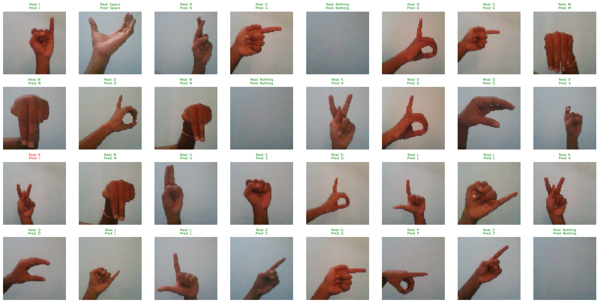
   
  <i>Fig 9. Resultados del primer batch de test del Custom CNN.</i>

### Resultados por categoría

Para poder visualizar cómo mejoró el modelo con estos cambios, realizamos las mismas comparaciones que el modelo anterior sobre su rendimiento en cada categoría.

Analizando el valor de accuracy, notamos que ha mejorado significativamente el accuracy de todas las categorías, especialmente las cuatro que representaban nuestro mayor reto, aunque siguen siendo de las letras con valores de accuracy más bajos. Es notable que el promedio subió de 0.82 a 0.97, en gran parte porque ya no existen outliers tan bajos y el accuracy menor de todos es el de **X** con ~0.85.

  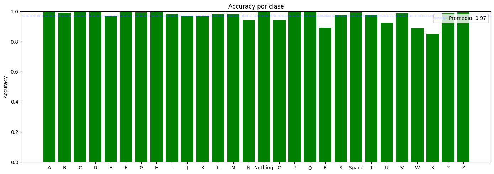
   
  <i>Fig 10. Accuracy por categoría del Custom CNN (test).</i>

Para asegurar que las predicciones han mejorado en su calidad, revisamos el precisión, recall y F1 score.

Aquí de nuevo vemos mejoras importantes. El F1 score más bajo es el de **V**, que subió de 0.40 en el modelo anterior a 0.90 en este modelo. También es notable que nuestro recall y precisión en general se nivelaron y en promedio son equivalentes. Esto nos indica, como veremos más adelante, que nuestra estrategia mejoró bastante el recall a lo largo de todo el dataset.

Revisando a mayor detalle, encontramos que:

* **R** tiene una precisión de 0.96 y un recall de 0.89. Mejoró bastante su habilidad de encontrar este símbolo.
* **S** tiene una precisión de 0.85 y un recall de 0.98. Es más preciso al predecir este símbolo.
* **U** tiene una precisión de 0.89 y un recall de 0.93. Aunque bajó su precisión, que antes era 1, subió importantemente su recall.
* **V** tiene una precisión de 0.83 y un recall de 0.99. Este es el símbolo con la precisión más baja del dataset.
* **W** tiene una precisión de 0.98 y un recall de 0.89. Este símbolo es el que más mejoró.
* **X** tiene una precisión de 0.99 y un recall de 0.85. La precisión mejoró ligeramente junto con un aumento importante en el recall.
* **Y** tiene una precisión de 1 y un recall de 0.99. El modelo sigue siempre prediciendo este símbolo correctamente, pero ahora también casi siempre lo encuentra.

También revisamos el efecto que estas mejoras tuvieron en la Confusion Matrix. Esperamos ver que, al aumentar el recall en todas las letras que antes causaban problemas, que la matriz estará más balanceada.

  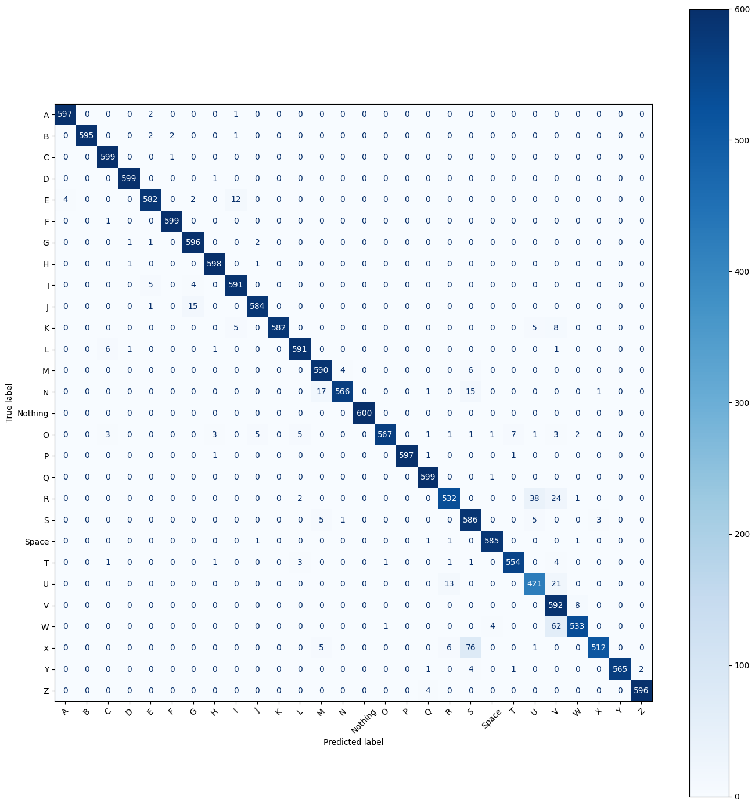
  <i>Fig 11. Confusion Matrix del Custom CNN.</i>

En efecto, identificamos los siguientes cambios:

* **R** se confunde principalmente por **U** y **V**, pero se redujo mucho la confusión.
* **T** ya casi no presenta confusiones.
* **U** se confunde principalmente por **V**, pero se redujo mucho la confusión.
* **W** se confunde principalmente por **V**,  pero se redujo mucho la confusión.
* **X** se confunde principalmente por **S**. Ya no se confunde por V.
* **Y** ya casi no presenta confusiones.

En otras palabras, el modelo ya aprendió correctamente todas las categorías. Sigue teniendo confusiones, aunque mucho menores, con **S** y **V**.

### Tabla comparativa CNN vs Custom CNN

Para facilitar la comparación, presentamos las mejoras entre los dos modelos de manera resumida:

|                          | CNN              | Custom CNN  |
| ------------------------ | ---------------- | ------------|
| Accuracy (train)         | 0.8728           | 0.9650      |
| Accuracy (val)           | 0.8256           | 0.9733      |
| Accuracy (test)          | 0.8233           | 0.9715      |
| Accuracy (avg / símbolo) | 0.82             | 0.97        |
| Precisión más baja       | 0.25 (V)         | 0.83 (V)    |
| Recall más bajo          | 0.01 (W)         | 0.85 (X)    |
| **Diagnóstico**          | **Underfitting** | **Fitting** |

<i>Fig 12. Tabla comparativa de resultados CNN vs Custom CNN.</i>

A este punto, podemos concluir que ya tenemos un modelo estable y confiable para la resolución del problema.

### Resultados con datos reales

Para evaluar el rendimiento del modelo, ya comprobado su entrenamiento, realizamos predicciones con imágenes reales de manos realizando señas ASL. Tomamos estas imágenes del internet, cuidando que sean JPG ya que el modelo se entrenó con tres canales de color (correspondientes a los tres canales de un JPG). Como parte del proceso de generación de la predicción, preprocesamos la imagen para reducir su tamaño a 64 x 64 (correspondiente a las imágenes que espera recibir el modelo), normalizamos los pixeles y agregamos un batch extra para representar el canal de batch con el que se entrenó el modelo (por utilizar generators).

  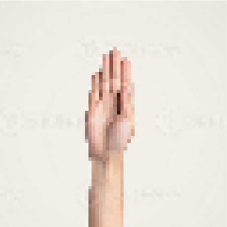
  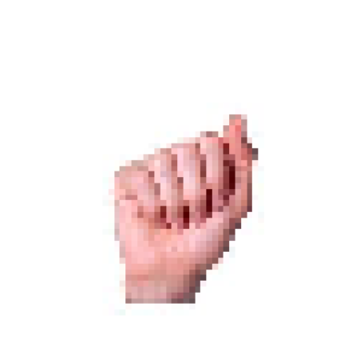
  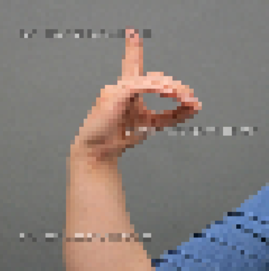
  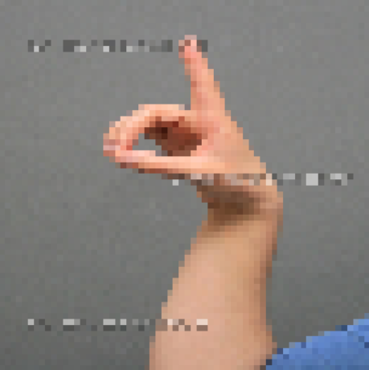
  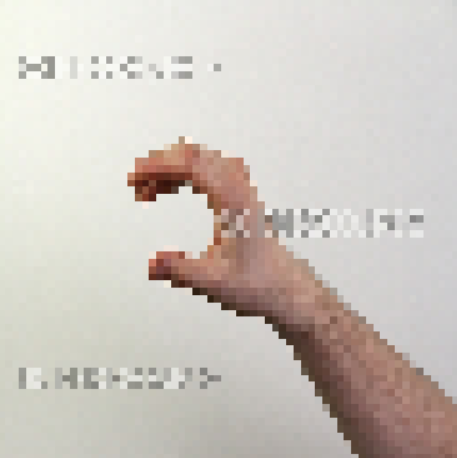
  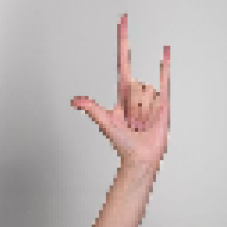
  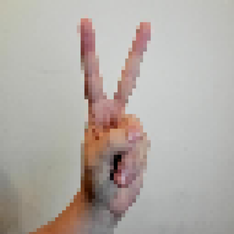
  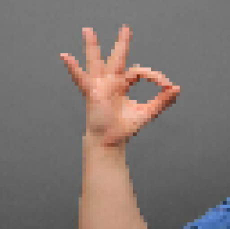
   
  <i>Fig 13. Imágenes de prueba reales del modelo Custom CNN.</i>

El modelo genera predicciones correctas para un poco más de la mitad de las imágenes. Presenta dificultades con imágenes cuyos fondos difieren mucho de los fondos del dataset de entrenamiento al ser más brillantes, dando menos contraste de la mano vs el fondo, y con iluminación que no sea directa. Por otro lado, es prometedor que logra identificar símbolos sin importar la orientación de la letra (como la letra D, que se evalua viendo a la izquierda y la derecha) y sin importar que la imagen tenga un poco de ruido visual (los watermarks que se ven en tres de las imágenes).

Estos resultados demuestran que existen áreas de mejora para el modelo. En particular, se necesita mejorar su habilidad de generalizar a otras calidades de las imágenes de entrenamiento.

### 4) Custom CNN con imágenes grayscale

Considerando los resultados de nuestro modelo Custom CNN, demostrando que le cuesta generalizar, para nuestra siguiente iteración vamos a entrenar el mismo modelo pero con imágenes a blanco y negro (grayscale)[^1][^2]. Este cambio reduce el impacto del color de las imágenes, que todas tienen una misma mano como modelo, y permite que el modelo se enfoque solamente en identificar patrones en las formas de la mano. También se espera que reduzca el efecto de las diferencias en el fondo y la iluminación al emparejar los colores en escalas de blanco y negro.

### Arquitectura

La arquitectura del modelo Custom CNN en sí ya demostró que es sólida con los datos y el problema, por lo que no la modificamos. Nos enfocamos más bien en los datos de entrenamiento, buscando eliminar factores que agregan ruido que está aprendiendo el modelo. No realizamos más cambios más allá de los necesarios para que el modelo acepte imágenes con solo un canal de color en vez de tres.

### Resultados generales

Evaluando los resultados de este modelo, notamos que los cambios a los datos no tuvieron un impacto significativo comparado al Custom CNN tradicional. A lo largo de 10 epochs, de nuevo se logra llegar hasta un **accuracy de ~96% en train** y un **accuracy de ~97% en val**. Se tienen saltos pequeños pero notables en los valores de val tanto para accuracy como para loss, reflejando un ajuste ligeramente imparejo durante el proceso de evaluación comparado con el de entrenamiento.

  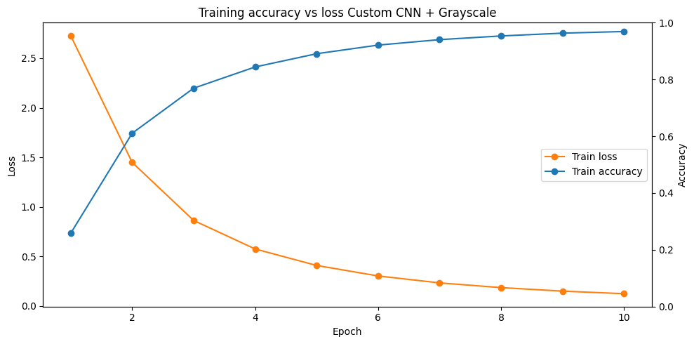
  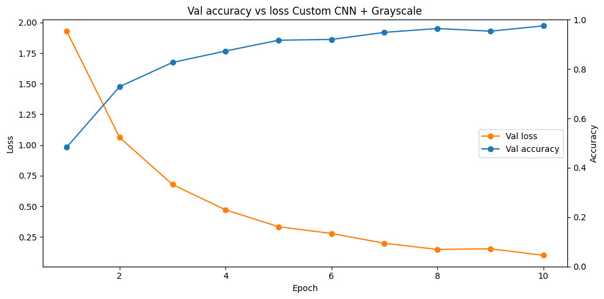
   
  <i>Fig 14. Gráficas de accuracy / loss para train (izquierda) y val (derecha) del modelo Custom CNN con grayscale.</i>

Es importante resaltar que los valores de accuracy de train y val son muy parecidos y el accuracy de val es ligeramente mejor (0.9690 vs 0.9752 respectivamente). Ambos valores son ligeramente mayores a los correspondientes de modelo Custom CNN. Esto es una buena señal que el cambio al dataset no afectó el **fitting** adecuado que teníamos previamente.

Procedemos con la evaluación del modelo con los datos de test. Con este set de datos, el modelo logra un **accuracy de ~97%**. Es interesante notar que este valor es muy parecido al accuracy de val (0.9727 de test vs 0.9752 de val). Con esto, podemos confirmar que este modelo tiene un **fitting** de los datos. Es notable que el accuracy de val es el más alto de los tres.

  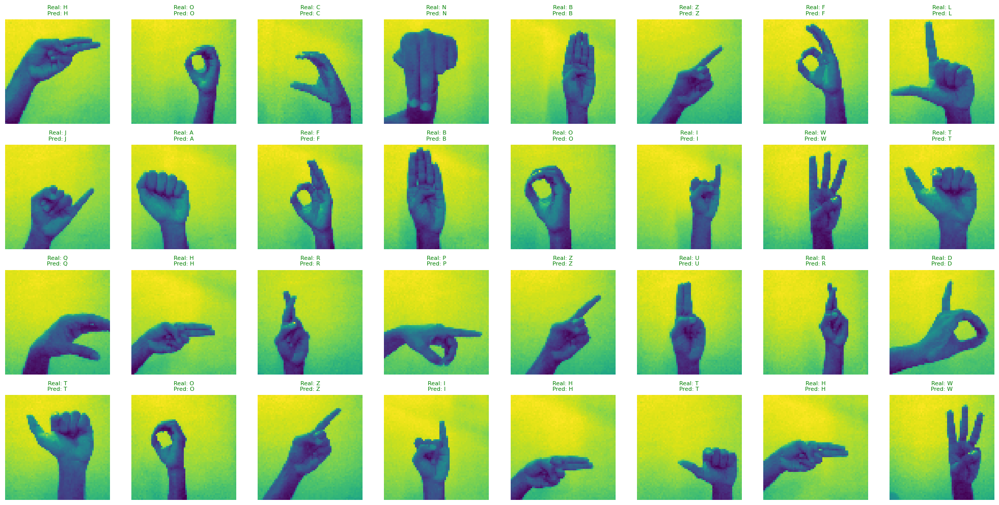
   
  <i>Fig 15. Resultados del primer batch de test del Custom CNN con grayscale.</i>

### Resultados por categoría

Para confirmar el efecto que tuvo el cambio al dataset en un nivel más granular, realizamos las mismas comparaciones que el modelo anterior sobre su rendimiento en cada categoría.

Analizando el valor de accuracy, notamos que se presentan resultados muy parecidos, aunque las letras que anteriormente demostraban el mayor reto se han emparejado importantemente. Es notable que el promedio se mantiene en 0.97. El accuracy menor de todos se mantiene igual en ~0.85, pero cambió el símbolo a **O**.

  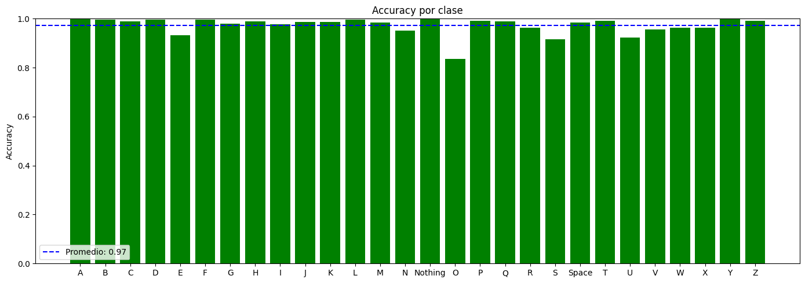
   
  <i>Fig 16. Accuracy por categoría del Custom CNN con grayscale (test).</i>

También revisamos el impacto en la precisión, recall y F1 score.

Aquí vemos mejoras pequeñas pero importantes. El F1 score más bajo es el de **O**, que subió a 0.91 en este modelo. También es notable que nuestro recall y precisión en general mejoraron ligeramente. Ninguno tiene un valor menor a 0.90 menos O.

Finalmente, revisamos el efecto que estas mejoras tuvieron en la Confusion Matrix para evaluar si han cambiado o mejorado las confusiones entre símbolos con el cambio a los datos.

  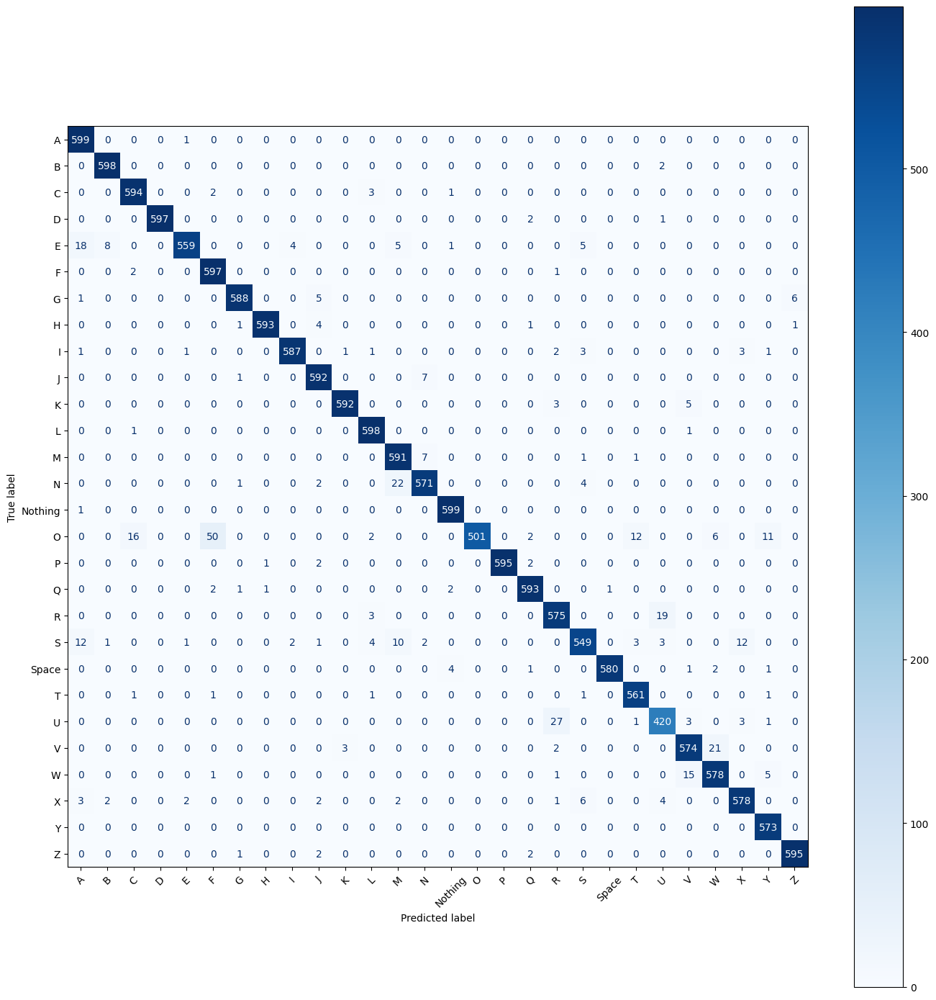
  <i>Fig 17. Confusion Matrix del Custom CNN con grayscale.</i>

Identificamos los siguientes cambios:

* **E** se confunde ligeramente por **A**.
* **O** se confunde ligeramente por **F**.
* **S** presenta confusiones, pero ninguna con un símbolo en particular.
* **U** se confunde principalmente por **R**, pero es una confusión mínima.

En otras palabras, el modelo por lo general aprendió ligeramente mejor las categorías. Aunque esto suena positivo, tendremos que confirmar el efecto que tendrá en su habilidad de generalizar con los datos reales.

### Resultados con datos reales

Para comparar entre modelos, utilizamos las mismas imágenes que con el modelo Custom CNN tradicional, pero con un preprocesamiento acorde. De nuevo reducimos su tamaño a 64 x 64, normalizamos los pixeles, agregamos un batch extra para representar el canal de batch con el que se entrenó el modelo (por utilizar generators). Además, las convertimos a blanco y negro.

  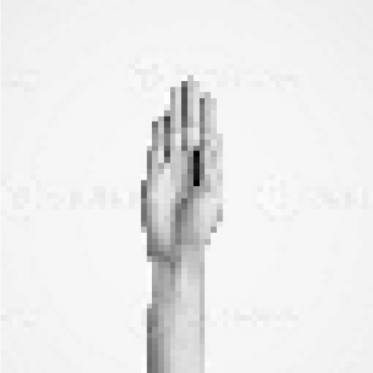
  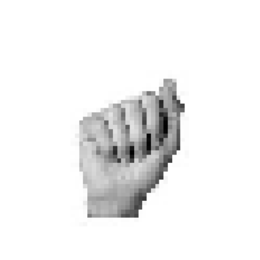
  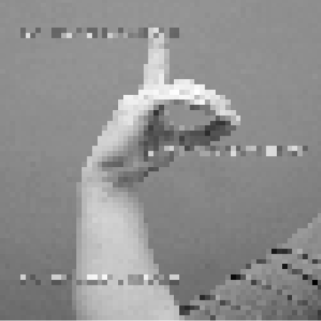
  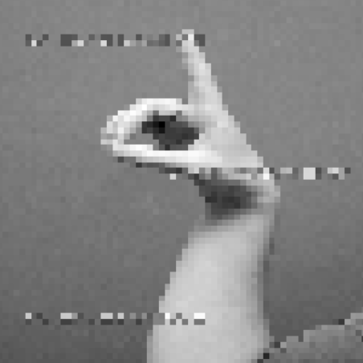
  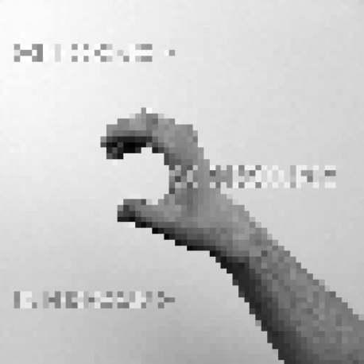
  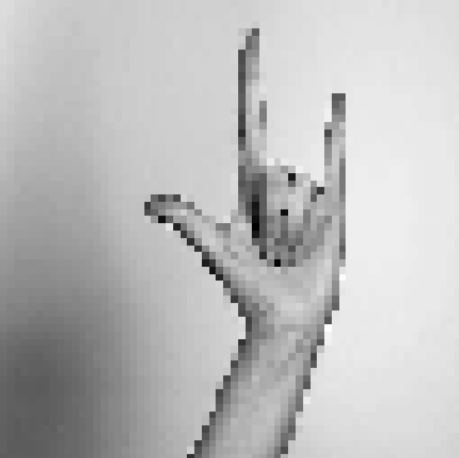
  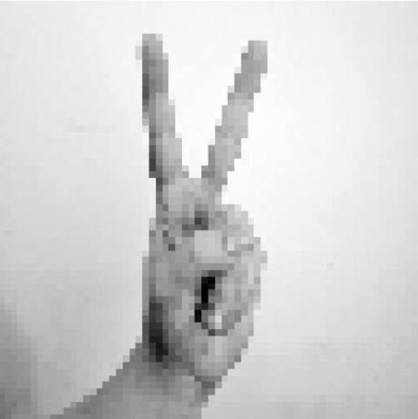
  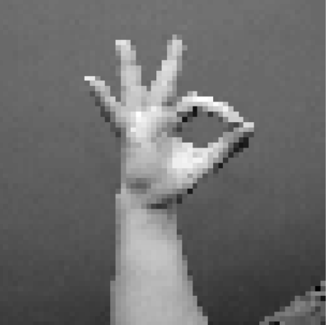
   
  <i>Fig 18. Imágenes de prueba reales del modelo Custom CNN con grayscale.</i>

Este modelo genera predicciones correctas para aproximadamente un tercio de las imágenes. Este cambio no mejoró la habilidad del modelo para generalizar y afectó su habilidad para distinguir ciertos símbolos que anteriormente sí logró identificar. Principalmente, se nota un impacto en símbolos donde los dedos se encuentran dentro de la palma de la mano. Aún así, aunque empeoró ligeramente su rendimiento, en varias imágenes su segunda o tercera predicción es la correcta, por lo que este modelo presenta mayormente problemas de confusión en vez de estar totalmente perdido.

### Tabla comparativa resultados con datos reales

Para facilitar la comparación de los modelos con datos reales, presentamos sus resultados de manera resumida. Sumamos un punto si la predicción del modelo es correcta (:white_check_mark:), 0.5 puntos si la segunda predicción es correcta y 0.25 puntos si la tercera predicción es la correcta (:grey_exclamation:). No se suman puntos si las primeras tres predicciones son incorrectas (:x:).

|               | Custom CNN            | Grayscale             |
| --------------| ----------------------| ----------------------|
| B             | :x:                | :x:                |
| A             | :x:                | :grey_exclamation: |
| D (derecha)   | :white_check_mark: | :x:                |
| D (izquierda) | :white_check_mark: | :grey_exclamation: |
| C             | :white_check_mark: | :white_check_mark: |
| Y             | :x:                | :x:                |
| V             | :grey_exclamation: | :white_check_mark: |
| F             | :white_check_mark: | :x:                | 
| **Aciertos**  | **4.5**               | **2.75**              |

<i>Fig . Tabla comparativa de resultados con datos reales de los modelos.</i>

Como se puede apreciar con la tabla, la estrategia que aplicamos para mejorar la generalización del modelo no apoyan esta meta y nuestro mejor modelo sigue siendo el primero que desarrollamos. Es probable que cambiar las imágenes del entrenamiento para utilizar blanco y negro elimina información útil sútil que aportan los colores para distinguir símbolos que tienen formas generales parecidas o dependen de la posición de los dedos dentro de la figura. Aunque agrega variedad que ayuda al modelo a verse menos afectado por cambios en el fondo e iluminación, tuvo un impacto en la habilidad de modelo para distinguir matices en símbolos con formas generales parecidas.

Aún así, es importante notar que el modelo entrenado con imágenes grayscale por lo general presentó menos confianza en sus predicciones incorrectas. Todas las predicciones tenían porcentajes más parejos entre sus primeras tres predicciones, donde en ciertos casos una predicción cercana era el valor real de la imagen y en donde las tres predicciones eras símbolos parecidos a la vista humana. Esto es a diferencia del primer modelo, que presenta menos confusiones y tiene predicciones con porcentajes de confianza muy altos, incluso cuando está totalmente equivocado. Por lo general, el primer modelo también presenta segundas y terceras predicciones que no tienen mucho sentido a la vista humana.

## Conclusión

El rendimiento de los dos modelos con datos reales nos indica que nuestro modelo, aunque opera bien con los datos de entrenamiento, validación y prueba, se ve fundamentalmente limitado en casos reales por el dataset con el que está entrenando. Para tener mejores resultados, se tendría que diversificar el dataset para incluir otros ángulos, manos y fondos, o cambiar completamente de enfoque para el procesamiento de las formas de la mano. Aún así, considerando las limitaciones del proyecto y la gran complejidad del problema, ya que cada persona realiza los símbolos de manera ligeramente distinta, se logró crear un modelo decente para la identificación de ASL.

## Correcciones

* Se agregó la documentación del preprocesado de datos al README.
* Se agregó la funcionalidad de guardar los datos preprocesados en un archivo zip para cargar de Google Drive en futuras iteraciones.
* Se ajustaron las gráficas de accuracy / loss para emparejar ejes y / facilitar interpretación.
* Se agregaron mejoras para generalización al modelo.
* Se agregó la documentación de resultados con datos reales para los modelos.

[^1]: P. Moon, G. Yenurkar, V. O. Nyangaresi, A. Raut, N. Dapkekar, J. Rathod, and P. Dabare, "An improved custom convolutional neural network based hand sign recognition using machine learning algorithm," *Engineering Reports*, vol. 6 no. 10, Feb. 2024. doi: 10.1002/eng2.12878. [Online]. Available: https://onlinelibrary.wiley.com/doi/epdf/10.1002/eng2.12878?getft_integrator=scopus&src=getftr.
‌
[^2]: S. B. S. Mugdha, H. Das, M. Uddin, M. E. Arafat, and M. M. Islam, "DeafTech Vision: A Visual Computer's Approach to Accessible Communication through Deep Learning-Driven ASL Analysis," *Stat., Optim. Inf. Comput.*, vol. 12, no. 6, pp. 1795–1811, Jun. 2024. doi: 10.19139/soic-2310-5070-2020. [Online]. Available: https://iapress.org/index.php/soic/article/view/2020/1120.

[^3]: B. Alsharif, E. Alalwany, A. Ibrahim, I. Mahgoub, and M. Ilyas, "Real-Time American Sign Language Interpretation Using Deep Learning and Keypoint Tracking," *Sensors*, vol. 25, Mar 2025. doi: 10.3390/s25072138. [Online]. Available: https://www.mdpi.com/1424-8220/25/7/2138.

[^4]: A. N. Fierro Radilla, K. R. Perez Daniel, G. Benitez Garcia, P. Najera Garcia, and R. Fuentes Valdez, "Similarity Learning for CNN-Based ASL Alphabet Recognition," *Frontiers in Artificial Intelligence and Applications*, vol. 337, pp. 633-645, 2021. doi: 10.3233/faia210060.

[^5]: P. Das, T. Ahmed, and M. F. Ali, "Static Hand Gesture Recognition for American Sign Language Using Deep Convolutional Neural Network," *2020 IEEE Region 10 Symposium (TENSYMP)*, pp. 1795–1811, June 2020. doi: 10.1109/TENSYMP50017.2020.9230772. [Online]. Available: https://ieeexplore.ieee.org/document/9230772.